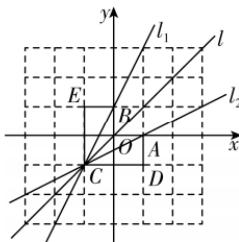
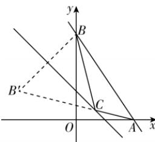

> [!faq]- 答案与解析
>
> > [!success]- **【答案】** D
>
> > [!note]- **【解析】**
> > $x - y = 0$ 或 $x + y + 2 = 0$ 【解析】易知 $l_{1}$ 与 $y$ 轴交于点 $B(0,1), l_{2}$ 交 $x$ 轴于点 $A(1,0)$ ，联立 $\left\{ \begin{array}{l} 2x - y + 1 = 0, \\ x - 2y - 1 = 0, \end{array} \right.$ 解得 $\left\{ \begin{array}{l} x = -1, \\ y = -1, \end{array} \right.$ 则直线 $l_{1}, l_{2}$ 的交点为 $C(-1, -1)$ . 如图，在网格中构造 $\triangle ACD, \triangle BCE$ ，易知都为直角三角形，且 $\triangle ACD \cong \triangle BCE$ ，则 $\angle BCE = \angle ACD$ . 又 $\angle OCE = \angle OCD = 45^{\circ}$ ，所以 $\angle OCE - \angle BCE = \angle OCD - \angle ACD \Rightarrow \angle BCO = \angle ACO$ ，即直线 $OC$ 为两直线 $l_{1}$ 与 $l_{2}$ 夹角的平分线所在直线，所以直线 $OC$ 符合题意，易知其方程为 $x - y = 0$ ；当直线 $l$ 过点 $C$ 且与直线 $x - y = 0$ 垂直时，也符合题意，此时直线方程为 $x + y + 2 = 0$ .
> >
> > 
> >
> > $|CB|$ . 若 $|CA| + |CB|$ 最小, 即 $|CA| + |CB'|$ 最小, 则当 $C, B', A$ 三点共线时 $|CA| + |CB'|$ 最小, 此时 $k_{AB'} = \frac{1-0}{-2-2} = -\frac{1}{4}$ , 故直线 $AB'$ 的方程为 $y = -\frac{1}{4}(x - 2)$ . 由 $\left\{\begin{aligned} y &= -\frac{1}{4}(x - 2), \\ x + y &= -1 = 0 \end{aligned}\right.$ 得 $\left\{\begin{aligned} x &= \frac{2}{3}, \\ y &= \frac{1}{3}, \end{aligned}\right.$ 即 $C\left(\frac{2}{3}, \frac{1}{3}\right)$ . 故选 D.
> >
> > 
