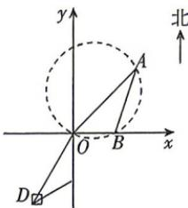

<!-- question-source:start -->
14. [山东淄博 2025 高二月考] 已知以点 $A(-1,2)$ 为圆心的圆与直线 $3x + 4y + 5 = 0$ 相切.

人生是个圆,有的人走了一辈子也没有走出命运画出的圆圈,他就是不知道,圆上的每一个点都有一条腾飞的切线。

(1) 求圆 A 的方程;

(2) 过点 $B(0, -1)$ 的直线 $l$ 与圆 $A$ 相交于 $M, N$ 两点，当 $|MN| = 2\sqrt{3}$ 时，求直线 $l$ 的方程；

(3)已知实数 x, y 满足圆 A 的方程, 求 $(x - 2)^{2} + y^{2}$ 的取值范围.

平面直角坐标系, 圆 C 经过 O, A, B 三点.

(2) 若圆 C 区域内有未知暗礁, 现有一船 D 在 O 岛的南偏西 $30^{\circ}$ 方向距 O 岛 4 千米处, 正沿着北偏东 $60^{\circ}$ 方向行驶, 若不改变方向, 试问该船有没有触礁的危险?

(1) 求圆 C 的方程.

## 题型4 直线与圆的方程的应用
<!-- question-source:end -->
