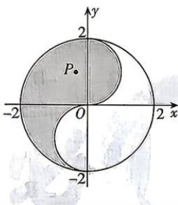

<!-- question-source:start -->
15. [江苏无锡一中 2026 高二期中]“太极图”因其形状如对称的阴阳两鱼互抱在一起, 故也被称为 “阴阳鱼太极图”. 如图是放在平面直角坐标系中

的“太极图”. 图中曲线为圆或半圆, 已知点 $P(x,y)$ 是阴影部分内 (包括边界) 一动点, 则 $\frac{y}{x-2}$ 的最小值为 ( )
A. $-\frac{2}{3}$ B. $-\frac{3}{2}$ C. $-\frac{4}{3}$ D.1
<!-- question-source:end -->
