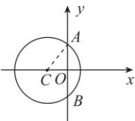
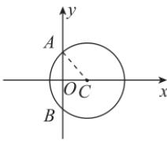

> [!faq]- 答案与解析
>
> > [!success]- **【答案】** D
>
> > [!note]- **【解析】**
> > D 【解析】由题意得 $|AC|=5,|AB|=8$ ，所以 $|AO|=4$ ，在Rt△AOC中， $|OC|=\sqrt{|AC|^{2}-|AO|^{2}}=\sqrt{5^{2}-4^{2}}=3.$
> >
> > [144]
> >
> > 如图所示,有两种情况:
> >
> > 
> >
> > 
> >
> > 故圆心 C 的坐标为 $(-3,0)$ 或 $(3,0)$ ，故所求圆的标准方程为 $(x \pm 3)^{2} + y^{2} = 25$ .
> >
> > 易错警示 解答本题易出现两种错误,一是求解方程时,因受思维定式的影响,利用图形辅助解题时漏掉一种情况;二是由于对圆的标准方程形式把握不准而将圆的标准方程写错.
> >
> > ## 2.4.2 圆的一般方程
> >
> > ## 刷基础
