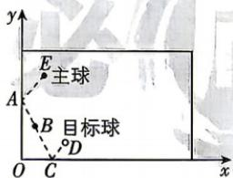

<!-- question-source:start -->
5. 新考向 创新情境 [河南多校2026高二期中联考] 台球是一项在球桌上用球杆击打主球以撞击目标球的

体育运动,假设主球(大小忽略不计,看作一个点)在球桌上均做直线运动,碰撞到球桌壁后反弹时满足反射角等于入射角.如图,现击打主球E在球桌壁点A反弹后,经过点B,再在球桌壁点C反弹后,击中目标球D.以球桌壁所在直线分别为x,y轴,建立如图所示的平面直角坐标系,发现点B的坐标为(1,3),目标球D的坐标为(3,1),则在该坐标系中,点A的坐标为() A. $\left(0,\frac{7}{2}\right)$ B.(0,4)

√ 答案 P141

C. $\left(0, \frac{9}{2}\right)$ D. $(0,5)$
<!-- question-source:end -->
