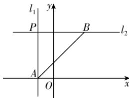
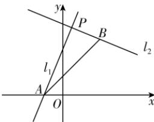

> [!faq]- 答案与解析
>
> > [!success]- **【答案】** D
>
> > [!note]- **【解析】**
> > D 【解析】当 $\theta=\frac{\pi}{3}$ 时，直线的斜率 $k=\tan\frac{\pi}{3}=\sqrt{3}$ ，直线方程为 $y=\sqrt{3}x$ ，联立 $\left\{\begin{aligned}y&=\sqrt{3}x,\\ x&+\sqrt{3}y-4=0\end{aligned}\right.$ 得， $\left\{\begin{aligned}x&=1,\\ y&=\sqrt{3}\end{aligned}\right.$ ，则 $P_{1}(1,\sqrt{3})$ ；当 $\theta=\frac{2\pi}{3}$ 时，直线的斜率 $k=\tan\frac{2\pi}{3}=-\sqrt{3}$ ，直线方程为 $y=-\sqrt{3}x$ ，联立 $\left\{\begin{aligned}y&=-\sqrt{3}x,\\ x&+\sqrt{3}y-4=0\end{aligned}\right.$ 得， $\left\{\begin{aligned}x&=-2,\\ y&=2\sqrt{3}\end{aligned}\right.$ 则 $P_{2}(-2,2\sqrt{3})$ 。所以点 P 的轨迹长度 $|P_{1}P_{2}|=$ $\sqrt{(1+2)^{2}+(\sqrt{3}-2\sqrt{3})^{2}}=2\sqrt{3}.$ 故选 D. $\rightarrow$ 点悟：当 $\theta$ 从 $\frac{\pi}{3}$ 转到 $\frac{2\pi}{3}$ 时，点 P 在直线 $x+\sqrt{3}y-4=0$ 上从点 $P_{1}$ 运动到点 $P_{2}$
> >
> > 思路导引 根据直线方程求出定点A,B的坐标,对m进行分类讨论,利用直线垂直的条件可证两直线垂直,从而求得 $|PA|+|PB|$ 的最大值.
> > 【解析】对直线 $l_{1}: x + my + 1 = 0$ ，当 y = 0 时，x = -1，则直线 $x + my + 1 = 0$ 过定点 A(-1,0).
> > 对直线 $l_{2}$ : mx - y - 2m + 3 = 0, 即 m(x - 2) - y + 3 = 0, 当 x = 2 时, y = 3, 则直线 mx - y - 2m + 3 = 0 过定点 B(2,3).
> > 当 m=0 时, 如图①, 直线 $l_{1}: x=-1$ , 直线 $l_{2}: y=3$ , 则交点 P(-1,3), 此时 $|PA|=3, |PB|=3, \therefore |PA|+|PB|=6.$
> >
> > 
> > 图①
> >
> > 当 $m \neq 0$ 时，如图②，直线 $l_{1}$ 的斜率 $k_{1} = -\frac{1}{m}$ ，直线 $l_{2}$ 的斜率 $k_{2} = m$ .
> > ∵ $k_{1}k_{2}=-1,\therefore l_{1}\perp l_{2}$ ，则△PAB是直角三角形，∴ $|PA|^{2}+|PB|^{2}=|AB|^{2}=(2+1)^{2}+(3-0)^{2}=18$ 又∵ $(|PA|+|PB|)^{2}=|PA|^{2}+|PB|^{2}+2|PA||PB|\leqslant2(|PA|^{2}+|PB|^{2})=2\times18=36$ ，且 $|PA|+|PB|>0$ ∴ $|PA| + |PB| \leqslant 6$ ，当且仅当 $|PA| = |PB| = 3$ ，即 m = 0 时，等号成立，又 $m \neq 0$ ，∴ 等号取不到，
> > ∴ $|PA| + |PB| < 6$ .
> >
> > 
> > 图②
> >
> > 综上, $|PA|+|PB|$ 的最大值为6.
> >
> > 故选 **B**.
