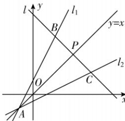
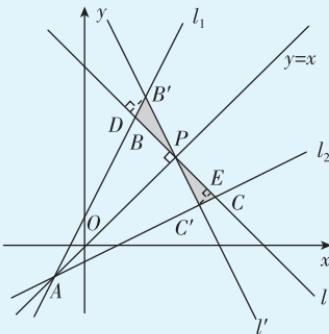

> [!faq]- 答案与解析
>
> > [!success]- **【答案】** C
>
> > [!note]- **【解析】**
> > $\frac{32}{3}$ 【解析】由 $\left\{ \begin{array}{l} 2x - y + 1 = 0, \\ x - 2y - 1 = 0 \end{array} \right.$ 解得 $\left\{ \begin{array}{l} x = -1, \\ y = -1, \end{array} \right.$ 所以直线 $l_{1}$ 与 $l_{2}$ 交于点 $A(-1, -1)$ ，且两直线关于直线 $y = x$ 对称，点 $P$ 在直线 $y = x$ 上，设直线 $l$ 与 $l_{1}, l_{2}$ 的交点分别为 $B, C$ . 当点 $P$ 为 $BC$ 的中点时， $S_{\triangle ABC}$ 最小. 由对称性可知当直线 $l$ 垂直于直线 $y = x$ 时，点 $P$ 为 $BC$ 的中点，此时直线 $BC: x + y = 6$ ，故 $B\left( \frac{5}{3}, \frac{13}{3} \right), C\left( \frac{13}{3}, \frac{5}{3} \right)$ ，则 $|BC| = \frac{8\sqrt{2}}{3}, |PA| = 4\sqrt{2}$ ，则 $S_{\triangle ABC} = \frac{1}{2}|BC| \cdot |PA| = \frac{32}{3}$ .
> >
> > 
> >
> > 链接教材 本题是教材第102页第11题的延伸，综合考查直线中的对称、垂直问题，以及分析三角形面积取得最值时的情况.
> > 此题用到一个结论：
> > 已知点 P 在直线 $l_{1}$ 与 $l_{2}$ 的对称轴直线上（非三线交点），则过点 P 有一条直线 l，当它夹在相交直线 $l_{1}$ 与 $l_{2}$ 之间的线段恰好被点 P 平分时，三条直线 $l, l_{1}, l_{2}$ 所围成的三角形面积最小.
> > 证明：假设直线 l 垂直于直线 $l_{1}, l_{2}$ 的对称轴直线 y = x，与直线 $l_{1}, l_{2}$ 的交点分别为 B, C. 直线 $l'$ 过点 P 且不垂直于直线 y = x，与 $l_{1}, l_{2}$ 的交点分别为 $B', C'$ .
> > 作 $B^{\prime}D\perp BC$ 于点 D，作 $C^{\prime}E\perp BC$ 于点 E，如图所示. $S_{\triangle AB'C'}=S_{\triangle ABC}-S_{\triangle PCC'}+S_{\triangle PBB'}$ 由 $\angle B^{\prime}PD=\angle C^{\prime}PE,\angle PDB^{\prime}=\angle PEC^{\prime}$ 知 $\triangle PB^{\prime}D\sim\triangle PC^{\prime}E$ 易知 $|PD|>|PE|$ ，所以 $|B^{\prime}D|>|C^{\prime}E|$ . $S_{\triangle PBB'}=\frac{1}{2}|PB|\cdot|B'D|$ , $S_{\triangle PCC'}=\frac{1}{2}|PC|\cdot|C'E|$ 因为 $|PB|=|PC|, |B^{\prime}D|>|C^{\prime}E|$ ，所以 $S_{\triangle PBB'} > S_{\triangle PCC'}$ ，所以 $S_{\triangle AB'C'} = S_{\triangle ABC} - S_{\triangle PCC'} + S_{\triangle PBB'} > S_{\triangle ABC}$ .
> > 所以当点 P 为直线 l 被直线 $l_{1}, l_{2}$ 所截线段的中点时， $S_{\triangle ABC}$ 最小.
> >
> > 
