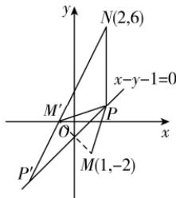

> [!faq]- 答案与解析
>
> > [!success]- **【答案】** 详见解析
>
> > [!note]- **【解析】**
> > 【解】(1)由直线 m 与 l 平行可设直线 m 的方程为 $x-y+C=0(C\neq-1)$ ，
> > 由 m, l 之间的距离为 $2\sqrt{2}$ ，得 $\frac{|C-(-1)|}{\sqrt{1^{2}+(-1)^{2}}} = 2\sqrt{2}$ ，解得 C = -5 或 C = 3，
> > 所以直线 m 的方程为 x-y-5=0 或 x-y+3=0.
> > (2) 设点 M(1,-2) 关于直线 l: x-y-1=0 的对称点为 $M'(a,b)$ ,
> > 则 $\left\{\begin{aligned}\frac{a+1}{2}-\frac{b-2}{2}-1=0,\\ \frac{b+2}{a-1}&=-1,\end{aligned}\right.$ 解得 $\left\{\begin{aligned}a&=-1,\\ b&=0,\end{aligned}\right.$ 即 $M'(-1,0)$ .
> > 而 $|PN|-|PM|=|PN|-|PM'| \leqslant |NM'|$ ，当且仅当 P, $M', N$ 三点共线时取等号，
> > 直线 $NM'$ 的方程为 $y-0=\frac{6-0}{2-(-1)}(x+1)$ ，即 $2x-y+2=0$ ，
> > 由 $\left\{\begin{aligned}x-y-1=0,\\ 2x-y+2=0\end{aligned}\right.$ 解得 $\left\{\begin{aligned}x&=-3,\\ y&=-4,\end{aligned}\right.$ 所以 $|PN|-|PM|$ 取得最大值时点 P 的坐标为 $(-3,-4)$ .
> >
> > 
> >
> > ## 刷素养
