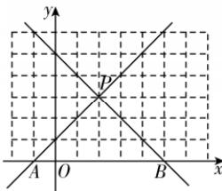

> [!faq]- 答案与解析
>
> > [!success]- **【答案】** C
>
> > [!note]- **【解析】**
> > C 【解析】如图, 因为点 P 在直线 $x-y+1=0$ 上, 且横坐标为 2, 所以点 P 的坐标为 $(2,3)$ .
> > 点 A 为直线 $x-y+1=0$ 与 x 轴的交点, 所以 $A(-1,0)$ .
> > 又点 B 在 x 轴上, 且 $|PA| = |PB|$ , 则点 $(2,0)$ 是线段 AB 的中点, 所以 $B(5,0)$ , 所以直线 PB 的方程为 $\frac{y-0}{3-0}=\frac{x-5}{2-5}$ , 即 y=-x+5. 故选 C.
> >
> > 
