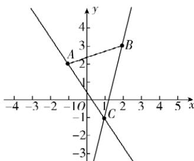

> [!faq]- 答案与解析
>
> > [!success]- **【答案】** AB
>
> > [!note]- **【解析】**
> > AB 【解析】对于 A, 在直线 $l: x = my + 1$ 中, 令 y = 0, 则 x = 1, 所以直线 l 过定点 (1, 0), 故 A 正确; 对于 B, 当 m = 0 时, 直线 l: x = 1, 此时直线 l 的斜率不存在, 故 B 正确; 对于 C, 当 $m = \sqrt{3}$ 时, 直线 $l: x = \sqrt{3}y + 1$ , 所以直线 l 的斜率为 $\frac{\sqrt{3}}{3}$ , 倾斜角为线段 AB 上的点连线所在直线的斜率.
> >
> > 
> >
> > ## 2.2 直线的方程
> >
> > $30^{\circ}$ , 故 C 错误; 对于 D, 当 $m = 2$ 时, 直线 $l: x = 2y + 1$ , 令 $x = 0$ , 得 $y = -\frac{1}{2}$ , 即直线 $l$ 在 $y$ 轴上的截距为 $-\frac{1}{2}$ , 故 D 错误.
> >
> > 故选 **AB**. 避坑: 截距不是距离, 直线在 $y$ 轴上的截距即为直线与 $y$ 轴交点的纵坐标
