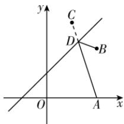
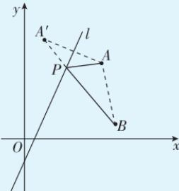
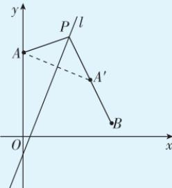

> [!faq]- 答案与解析
>
> > [!success]- **【答案】** D
>
> > [!note]- **【解析】**
> > D 【解析】设点 $B(4,4)$ 关于直线 $x-y+2=0$ 对称的点为 $C(x_{0},y_{0})$ ,
> >
> > 
> >
> > 则有 $\left\{\begin{aligned}\frac{y_{0}-4}{x_{0}-4}&=-1,\\ \frac{x_{0}+4}{2}&-\frac{y_{0}+4}{2}+2=0,\end{aligned}\right.$ 解得 $\left\{\begin{aligned}x_{0}&=2,\\ y_{0}&=6,\end{aligned}\right.$ 即
> > C(2,6). 所以“将军饮马”的总路程最短为 $|AC|=\sqrt{(2-4)^{2}+(6-0)^{2}}=2\sqrt{10}.$ → 点悟：两点之间线段最短， $|BD|+$ $|AD|=|CD|+|AD|\geqslant|AC|$ 故选 D.
> >
> > 规律方法 求直线 l 上一点 P 到两定点 A, B 距离之和的最小值, 若两定点在直线 l 的同侧, 则可取点 A 关于直线 l 的对称点 $A'$ , 如图①, 则 $|PA| = |PA'|$ , $(|PA| + |PB|)_{\min} = |A'B|$ ; 若两定点在直线 l 的两侧, 则 $|AB|$ 即为所求.
> >
> > 
> > 图①
> >
> > 求直线 l 上一点 P 到两定点 A, B 距离之差的最大值，若两定点在直线 l 的同侧，则 $\left|\left|PA\right|-\left|PB\right|\right|_{\max}=\left|AB\right|$ ；若两定点在直线 l 的两侧，则可取点 A 关于直线 l 的对称点 $A'$ ，如图②，则 $\left|PA\right|=\left|PA'\right|$ ， $\left|\left|PA\right|-\left|PB\right|\right|_{\max}=\left|\left|PA'\right|-\left|PB\right|\right|_{\max}=\left|A'B\right|$ .
> >
> > 
> > 图②
> >
> > 这类最值问题,可以由对称性及平面几何知识转化,利用(1)三角形任意两边之和大于第三边;(2)三角形任意两边之差的绝对值小于第三边;(3)两点之间线段最短求解.
