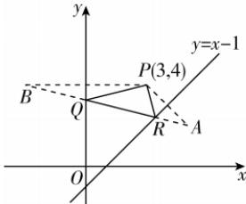

> [!faq]- 答案与解析
>
> > [!success]- **【答案】** 2 $\sqrt{17}$
>
> > [!note]- **【解析】**
> > 设点 $P(3,4)$ 关于直线 $y = x - 1$ 的对称点为 $A(m,n)$ ，则 $\left\{ \begin{array}{l} \frac{n + 4}{2} = \frac{m + 3}{2} - 1, \\ \frac{n - 4}{m - 3} \cdot 1 = -1, \end{array} \right.$ 解得 $\left\{ \begin{array}{l} m = 5, \\ n = 2, \end{array} \right.$ 故 $A(5,2)$ . 又点 $P(3,4)$ 关于 $y$ 轴的对称点为 $B(-3,4)$ ，则 $|PQ| = |BQ|, |RA| = |PR|$ ，所以 $\triangle PQR$ 的周长为 $|PQ| + |QR| +$ $|RP|=|BQ|+|QR|+|RA|\geqslant|AB|=\sqrt{(-3-5)^{2}+(4-2)^{2}}=2\sqrt{17}$ ，当且仅当B,Q,R,A四点共线时， $\triangle PQR$ 的周长取到最小值 $2\sqrt{17}$ .
> >
> > 
