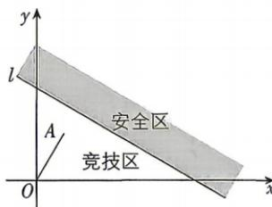

<!-- question-source:start -->
8. 新考向 创新情境 [甘肃兰州一中 2026 高二期末] 从 2025 年央视春晚机器人节目《秧BOT》中“福兮”机器人

扭秧歌、转手绢的灵动，到2026年机器人节目《武BOT》中G1和H2人形机器人打醉拳、后空翻的矫健，中国机器人技术正以前所未有的速度“进化”。为培养青少年对机器人技术的兴趣，某市举办机器人设计大赛，在比赛中有一个追逐项目，如图，在平面直角坐标系 $xOy$ 中，直线 $l: x + \sqrt{3} y - 6 = 0$ 为竞技区与安全区的分界线，机器人甲在点 $O$ 处，机器人乙在竞技区内的点 $A$ 处，点 $A$ 在第一象限，且直线 $OA$ 的倾斜角为 $60^{\circ}$ 。已知机器人甲的速度大小是机器人乙的3倍，机器人甲、乙可以向任意方向直线前进，机器人甲、乙同时出发，若要保证机器人甲在竞技区（含直线 $l$ ）内一定能追上机器人乙，则线段 $OA$ 长度的最大值是\_\_\_\_。

## 刷素养
<!-- question-source:end -->
