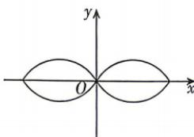

<!-- question-source:start -->
11.[湖北武昌实验中学2026高二段考]小明同学利用AI软件生成了一段形状优美的曲线C,其方程为 $x^{2}+y^{2}=2\sqrt{3}|x|-2|y|$ ，形状酷似数学符号“∞”（如图），对于此曲线，下列说法正确的是()

$$
x ^ {2} + y ^ {2} = 5
$$

C. 曲线 C 所围成的图形的面积为 $\frac{8\pi}{3}-2\sqrt{3}$ D. 若点 P 在曲线 C 上, 点 $Q(0, -2)$ , 线段 PQ 的长度可能为 4

## 三、填空题: 本大题共 3 小题, 每小题 5 分, 共 15 分.
<!-- question-source:end -->
