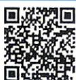
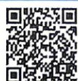

## 3.2.1 双曲线及其标准方程

  
视频讲解

  
错题本

## 刷基础

## 题型1 双曲线定义的理解

![[高中/课堂同步/教辅/必刷题/2027版 必刷题 数学选择性必修第一册RJA/03_第三章_圆锥曲线的方程/3_2_1_双曲线及其标准方程/questions/Q00072310.md]]
![[高中/课堂同步/教辅/必刷题/2027版 必刷题 数学选择性必修第一册RJA/03_第三章_圆锥曲线的方程/3_2_1_双曲线及其标准方程/questions/Q00072311.md]]
![[高中/课堂同步/教辅/必刷题/2027版 必刷题 数学选择性必修第一册RJA/03_第三章_圆锥曲线的方程/3_2_1_双曲线及其标准方程/questions/Q00072312.md]]
![[高中/课堂同步/教辅/必刷题/2027版 必刷题 数学选择性必修第一册RJA/03_第三章_圆锥曲线的方程/3_2_1_双曲线及其标准方程/questions/Q00072313.md]]
![[高中/课堂同步/教辅/必刷题/2027版 必刷题 数学选择性必修第一册RJA/03_第三章_圆锥曲线的方程/3_2_1_双曲线及其标准方程/questions/Q00072314.md]]
![[高中/课堂同步/教辅/必刷题/2027版 必刷题 数学选择性必修第一册RJA/03_第三章_圆锥曲线的方程/3_2_1_双曲线及其标准方程/questions/Q00072315.md]]
![[高中/课堂同步/教辅/必刷题/2027版 必刷题 数学选择性必修第一册RJA/03_第三章_圆锥曲线的方程/3_2_1_双曲线及其标准方程/questions/Q00072316.md]]
![[高中/课堂同步/教辅/必刷题/2027版 必刷题 数学选择性必修第一册RJA/03_第三章_圆锥曲线的方程/3_2_1_双曲线及其标准方程/questions/Q00072317.md]]
![[高中/课堂同步/教辅/必刷题/2027版 必刷题 数学选择性必修第一册RJA/03_第三章_圆锥曲线的方程/3_2_1_双曲线及其标准方程/questions/Q00072318.md]]
![[高中/课堂同步/教辅/必刷题/2027版 必刷题 数学选择性必修第一册RJA/03_第三章_圆锥曲线的方程/3_2_1_双曲线及其标准方程/questions/Q00072319.md]]
![[高中/课堂同步/教辅/必刷题/2027版 必刷题 数学选择性必修第一册RJA/03_第三章_圆锥曲线的方程/3_2_1_双曲线及其标准方程/questions/Q00072320.md]]
![[高中/课堂同步/教辅/必刷题/2027版 必刷题 数学选择性必修第一册RJA/03_第三章_圆锥曲线的方程/3_2_1_双曲线及其标准方程/questions/Q00072321.md]]
![[高中/课堂同步/教辅/必刷题/2027版 必刷题 数学选择性必修第一册RJA/03_第三章_圆锥曲线的方程/3_2_1_双曲线及其标准方程/questions/Q00072322.md]]
![[高中/课堂同步/教辅/必刷题/2027版 必刷题 数学选择性必修第一册RJA/03_第三章_圆锥曲线的方程/3_2_1_双曲线及其标准方程/questions/Q00072323.md]]
![[高中/课堂同步/教辅/必刷题/2027版 必刷题 数学选择性必修第一册RJA/03_第三章_圆锥曲线的方程/3_2_1_双曲线及其标准方程/questions/Q00072324.md]]
![[高中/课堂同步/教辅/必刷题/2027版 必刷题 数学选择性必修第一册RJA/03_第三章_圆锥曲线的方程/3_2_1_双曲线及其标准方程/questions/Q00072325.md]]
![[高中/课堂同步/教辅/必刷题/2027版 必刷题 数学选择性必修第一册RJA/03_第三章_圆锥曲线的方程/3_2_1_双曲线及其标准方程/questions/Q00072326.md]]
![[高中/课堂同步/教辅/必刷题/2027版 必刷题 数学选择性必修第一册RJA/03_第三章_圆锥曲线的方程/3_2_1_双曲线及其标准方程/questions/Q00072327.md]]
![[高中/课堂同步/教辅/必刷题/2027版 必刷题 数学选择性必修第一册RJA/03_第三章_圆锥曲线的方程/3_2_1_双曲线及其标准方程/questions/Q00072328.md]]
![[高中/课堂同步/教辅/必刷题/2027版 必刷题 数学选择性必修第一册RJA/03_第三章_圆锥曲线的方程/3_2_1_双曲线及其标准方程/questions/Q00072329.md]]
