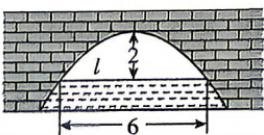

<!-- question-source:start -->
5.[河北邢台2025高二期中]图中展示的是一座抛物线形拱桥,当水面在l时,拱顶离水面2m,水面宽6m,水面下降1m后,水面宽度为()

A. $3\sqrt{3}\mathrm{m}$ B. $3\sqrt{2}\mathrm{m}$ C. $3\sqrt{6}\mathrm{m}$ D. $8\mathrm{m}$

√ 答案 P180
<!-- question-source:end -->
