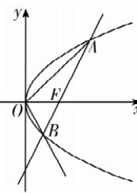

> [!faq]- 答案与解析
>
> > [!success]- **【答案】** B
>
> > [!note]- **【解析】**
> > B 【解析】如图, 不妨设点 B 在 x 轴下方, 因为 $O(0,0)$ , $F(1,0)$ , 且 $|BO| = |BF|$ , 所以 $x_{B} = \frac{1}{2}$ , 由抛物线方程可得
> >
> > 
> >
> > [181]
> >
> > $y_{B}=-\sqrt{2}$ ，则 $k_{AB}=\frac{\sqrt{2}}{1-\frac{1}{2}}=2\sqrt{2}$ ，所以直线 AB 的方程为 $y=2\sqrt{2}x-2\sqrt{2}$ ，联立直线与抛物线方程，消去 y 得 $(2\sqrt{2}x-2\sqrt{2})^{2}=4x$ ，化简得 $2x^{2}-5x+2=0$ ，所以 $x_{A}+x_{B}=\frac{5}{2}$ ，
> > 则 $\left|AB\right|=x_{A}+x_{B}+p=\frac{9}{2},O(0,0)$ 到直线 AB 的距离 $d=\frac{2\sqrt{2}}{3}$ ，所以 $\triangle OAB$ 的面积为 $\frac{1}{2}\times\frac{9}{2}\times\frac{2\sqrt{2}}{3}=\frac{3\sqrt{2}}{2}$ ，
> >
> > 故选 **B**.
