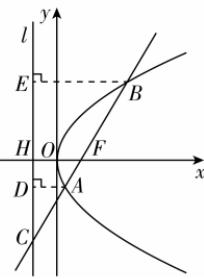
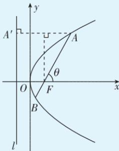

> [!faq]- 答案与解析
>
> > [!success]- **【答案】** C
>
> > [!note]- **【解析】**
> > C 【解析】抛物线 $y^{2}=4x$ 的焦点 F(1,0)，准线 l:x=-1，设准线 l 与 x 轴交于点 H，过点 A,B 分别作 $AD \perp l$ ， $BE \perp l$ ，垂足分别为 D,E.
> > 由抛物线的定义可知， $|AF|=|AD|$ ， $|BF|=|BE|$ ，又 $|AC|=2|AF|$ ，则 $|AC|=2|AD|$ ，则 $\angle ACD=\frac{\pi}{6}$ ，故 $\angle CAD = \angle CFH = \frac{\pi}{3}$ 又 $|HF|=p=2,\therefore\frac{|HF|}{|AD|}=\frac{|CF|}{|AC|}=\frac{3}{2}$ ，则 $|AF|=|AD|=\frac{4}{3}.$ 又直线 AB 的方程为 $y=\tan\frac{\pi}{3}(x-1)=\sqrt{3}(x-1)$ ，联立 $\left\{\begin{aligned}y^{2}&=4x,\\ y&=\sqrt{3}(x-1)\end{aligned}\right.$ 整理得 $3x^{2}-10x+3=0$ ，则 $x_{1}+x_{2}=\frac{10}{3}$ ，
> > 由抛物线的性质可知， $|AB|=x_{1}+x_{2}+p=\frac{16}{3},\therefore|AF|+|BF|=\frac{16}{3},$ ∴ $|BF|=\frac{16}{3}-\frac{4}{3}=4$ ，故选 C.
> >
> > 
> >
> > 多种解法 由解析知 $\angle ACD = \frac{\pi}{6}$ , 则直线 $AB$ 的倾斜角 $\theta = \frac{\pi}{3}$ , 所以 $|BF| = \frac{p}{1 - \cos \theta} = \frac{2}{1 - \cos \frac{\pi}{3}} = 4$ , 故选 C.
> >
> > 二级结论 设 AB 是过抛物线 $y^{2}=2px$ $(p>0)$ 焦点 F 的一条弦, $A(x_{1},y_{1})$ ,
> >
> > $B(x_{2},y_{2})$ ，直线 $AB$ 的倾斜角为 $\theta$ 如图.抛物线中的焦半径：过 $A$ 作 $AA^{\prime}\perp l$ 于 $A^{\prime}(l$ 为准线），则 $|AF| = |AA^{\prime}| = p + |AF|\cos \theta ,$ $\therefore |AF| = \frac{p}{1 - \cos\theta}$ ，同理， $|BF| =$ $\frac{p}{1 + \cos\theta}.$ 抛物线中的焦点弦： $|AB| = |AF|+$ $|BF| = \frac{p}{1 - \cos\theta} +\frac{p}{1 + \cos\theta} = \frac{2p}{1 - \cos^2\theta} =$ $\frac{2p}{\sin^2\theta}.$
> >
> > 
