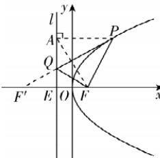

> [!faq]- 答案与解析
>
> > [!success]- **【答案】** $16(\sqrt{3}+1)$
>
> > [!note]- **【解析】**
> > 设准线 l 交 x 轴于点 E，过 P 作准线 l 的垂线，垂足为 A，连接 AF，
> > 由题知焦点 $F(4,0)$ , $|EF|=8$ , $|PA|=|PF|$ .
> >
> > 
> >
> > 因为 $P(12,8\sqrt{3})$ ，直线 PF 的斜率为 $\sqrt{3}$ ，所以 $\triangle PAF$ 为正三角形，
> > 所以 $\angle AFE = 60^{\circ}, |PF| = |AF| = 2|EF| = 16$ 记 F 关于直线 l 的对称点为 $F'(-12,0)$ ，
> > 连接 $QF'$ ，则 $|QF| = |QF'|$ ，
> > 则当 P, Q, $F'$ 三点共线时， $(|PQ| + |QF|)_{\min} = (|PQ| + |QF'|)_{\min} = |PF'| = 16\sqrt{3}$ 则 $\triangle PQF$ 的周长 $|PF| + |PQ| + |QF|$ 的最小值为 $16(\sqrt{3}+1)$ .
