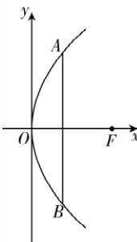

> [!faq]- 答案与解析
>
> > [!success]- **【答案】** A
>
> > [!note]- **【解析】**
> > A 【解析】如图所示, 在接收天线的轴截面所在平面上建立平面直角坐标系 Oxy, 使接收天线的顶点(即抛物线的顶点)与原点 O 重合, 焦点 F 在 x 轴上. 设抛物线的标准方程为 $y^{2}=2px$ (p>0). 由已知条件可得, 点 A(0.6,1.8) 在抛物线上, 所以 $1.2p=1.8^{2}$ , 解得 p=2.7, 因此该抛物线的焦点到顶点的距离为 1.35 m, 故选 A.
> >
> > 
