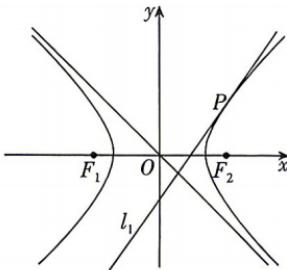

<!-- question-source:start -->
2.[上海黄浦区2026模拟考]已知双曲线 $\Gamma$ 的中心位于坐标原点 $O$ , 焦点 $F_{2}, F_{1}$ 分别在 $x$ 轴的正、负半轴上, $|F_{1}F_{2}| = 2\sqrt{2}$ , 直线 $y = -x$ 是 $\Gamma$ 的一条渐近线, 直线 $l_{1}: y = \sqrt{2} x + t (t < 0)$ 与 $\Gamma$ 有且只有一个公共点 $P$ .

(1) 求 $\Gamma$ 的方程.

(2) 若点 Q 在 y 轴上, 且 $\angle F_{1}QP$ 为直角, 求点 Q 的坐标.

(3) 设动直线 $l_{2}$ 平行于 $OP$ , 与 $\Gamma$ 交于点 $A$ , $B$ , 与 $l_{1}$ 交于点 $K$ , 是否存在常数 $\lambda$ , 使得 $|KA| \cdot |KB| = \lambda |KP|^2$ 总成立? 若存在, 请求出 $\lambda$ 的值; 若不存在, 请说明理由.

## 必刷题

<!-- question-source:end -->
