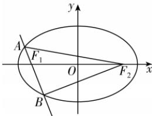

> [!faq]- 答案与解析
>
> > [!success]- **【答案】** B
>
> > [!note]- **【解析】**
> > B 【解析】易知 $F_{1}(-2\sqrt{2},0)$ ，由题可知直线 AB 的斜率存在，设直线 AB 的方程为 $y=k(x+2\sqrt{2})$ ，
> >
> > → 点悟：若直线 AB 的斜率不存在，则 $\left|AB\right|=\frac{2b^{2}}{a}=\frac{2}{3}\neq2$ ，不符合题意，所以直线 AB 的斜率存在
> >
> > 代入 $\frac{x^{2}}{9}+y^{2}=1$ 中整理得 $(9k^{2}+1)x^{2}+36\sqrt{2}k^{2}x+72k^{2}-9=0$ ，易知 $\Delta>0$ ，
> >
> > 所以 $x_{1}+x_{2}=-\frac{36\sqrt{2}k^{2}}{9k^{2}+1},x_{1}x_{2}=\frac{72k^{2}-9}{9k^{2}+1}$ ，
> >
> > 所以 $\left|AB\right|=\sqrt{(1+k^{2})\left[(x_{1}+x_{2})^{2}-4x_{1}x_{2}\right]}$ .
> >
> > 因为 $\left|AB\right|=2$ ，代入并解得 $k=\pm\frac{\sqrt{3}}{3}$ ，
> >
> > 故直线 AB 的倾斜角为 $\frac{\pi}{6}$ 或 $\frac{5\pi}{6}$ ，
> >
> > 所以 $S_{\triangle F_{2}AB} = \frac{1}{2} \times |AB| \times |F_{1}F_{2}| \cdot \sin \angle AF_{1}F_{2} = \frac{1}{2} \times 2 \times 4\sqrt{2} \times \frac{1}{2} = 2\sqrt{2}$ . 故选 B.
> >
> > 
