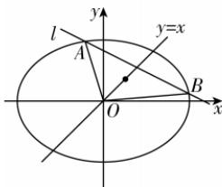

> [!faq]- 答案与解析
>
> > [!success]- **【答案】** D
>
> > [!note]- **【解析】**
> > D 【解析】设直线 l 的方程为 $y = -\frac{1}{2}x + t, t \neq 0, A(x_1, y_1), B(x_2, y_2)$ ，由 $\triangle OAB$ 点悟：若 t = 0，则直线 l 过原点 O，此时不存在 $\triangle OAB$ 的重心在直线 y = x 上，得 $\frac{x_1 + x_2 + 0}{3} = \frac{y_1 + y_2 + 0}{3}$ ，则 $x_1 + x_2 = y_1 + y_2$ ，即 $x_1 + x_2 = -\frac{1}{2}x_1 + t - \frac{1}{2}x_2 + t$ ，解得 $x_1 + x_2 = \frac{4}{3}t$ 。由 $\left\{\begin{aligned} y &= -\frac{1}{2}x + t, \\ b^2x^2 + a^2y^2 &= a^2b^2, \end{aligned}\right.$ 消去 y 得 $\left(\frac{1}{4}a^2 + b^2\right)x^2 - a^2tx + a^2t^2 - a^2b^2 = 0, \Delta = (-a^2t)^2 - 4\left(\frac{1}{4}a^2 + b^2\right)(a^2t^2 - a^2b^2) = a^2b^2(a^2 - 4t^2 + 4b^2) > 0$ ，即 $a^2 - 4t^2 + 4b^2 > 0$ ，于是 $x_1 + x_2 = \frac{a^2t}{\frac{1}{4}a^2 + b^2} = \frac{4}{3}t$ ，整理得 $a^2 = 2b^2$ ，所以椭圆的离心率 e = $\sqrt{1 - \frac{b^2}{a^2}} = \frac{\sqrt{2}}{2}$ 。故选 D.
> >
> > 
> >
> > 多种解法 设直线 l 的方程为 $y=kx+t(t\neq0)$ , $A(x_{1},y_{1})$ , $B(x_{2},y_{2})$ . 设 AB 中点为 C. 联立 $\left\{\begin{aligned}y&=kx+t,\\ \frac{x^{2}}{a^{2}}+\frac{y^{2}}{b^{2}}=1,\end{aligned}\right.$ 消去 y 得 $(a^{2}k^{2}+b^{2})x^{2}+2kta^{2}x+a^{2}t^{2}-a^{2}b^{2}=0,$
> >
> > $\Delta=4a^{2}b^{2}(a^{2}k^{2}-t^{2}+b^{2})>0$ ，于是 $x_{1}+x_{2}=-\frac{2kta^{2}}{a^{2}k^{2}+b^{2}},y_{1}+y_{2}=k(x_{1}+x_{2})+2t=\frac{2tb^{2}}{a^{2}k^{2}+b^{2}}$ ，则AB中点C的坐标为 $\left(-\frac{kta^{2}}{a^{2}k^{2}+b^{2}},\frac{tb^{2}}{a^{2}k^{2}+b^{2}}\right)$ ，由题意得点C
> > 在直线 y = x 上，故 $\frac{-kta^{2}}{a^{2}k^{2}+b^{2}}=\frac{tb^{2}}{a^{2}k^{2}+b^{2}}$ ，得 $k=-\frac{b^{2}}{a^{2}}$ ，即 $-\frac{b^{2}}{a^{2}}=-\frac{1}{2}$ ，即 $\frac{b^{2}}{a^{2}}=\frac{1}{2}$ ，所以椭圆的离心率 e= $\sqrt{1-\frac{b^{2}}{a^{2}}}=\frac{\sqrt{2}}{2}$ . 故选 D.
> >
> > 规律方法 对于直线与圆锥曲线位置关系问题的求解策略
> > (1) 研究直线与圆锥曲线位置关系时,一般将其转化为研究直线方程与圆锥曲线方程组成的方程组的解的问题,结合一元二次方程的根与系数的关系,转化为方程的性质进行求解;
> > (2) 对于直线与圆锥曲线位置关系的客观题,解答时注意图形的几何性质的应用,利用数形结合思想求解,有时更加方便;
> > (3) 合理应用“设而不求”法,在“设而不求”的技巧中,要注意运算的合理性、目的性,同时合理应用根与系数的关系、中点坐标公式、向量平行与垂直关系等,使得思路更加清晰,运算得以简化,从而迅速地解决问题.
