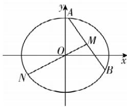

> [!faq]- 答案与解析
>
> > [!success]- **【答案】** AC
>
> > [!note]- **【解析】**
> > AC 【解析】对于 A, 易知 $b = 2\sqrt{3}$ , $\frac{c}{a} = \frac{1}{2}$ , $a^{2} - c^{2} = b^{2}$ , 解得 $a^{2} = 16$ , $c^{2} = 4$ , 所以椭圆 C: $\frac{x^{2}}{16} + \frac{y^{2}}{12} = 1$ , 故 A 正确; 对于 B, 设 $A(x_{1}, y_{1})$ , $B(x_{2}, y_{2})$ , 则 $\left\{\begin{aligned}\frac{x_{1}^{2}}{16} + \frac{y_{1}^{2}}{12 &= 1, \\ \frac{x_{2}^{2}}{16} + \frac{y_{2}^{2}}{12 &= 1,\end{aligned}\right.$ 作 差 得 $\frac{(x_{1}-x_{2})(x_{1}+x_{2})}{16} + \frac{(y_{1}-y_{2})(y_{1}+y_{2})}{12} = 0$ , 即 $\frac{(y_{1}-y_{2})(y_{1}+y_{2})}{(x_{1}-x_{2})(x_{1}+x_{2})} = -\frac{12}{16} = -\frac{3}{4} = \frac{\frac{y_{1}+y_{2}}{2}}{\frac{x_{1}+x_{2}}{2}} \cdot \frac{y_{1}-y_{2}}{x_{1}-x_{2}} = k_{OM} \cdot k_{AB}$ , 易知 $k_{OM} = \frac{1-0}{2-0} = \frac{1}{2}$ , 则 $k_{AB} = -\frac{3}{2}$ , 故 B 错误;
> >
> > 
