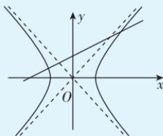
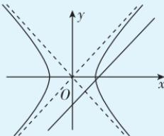
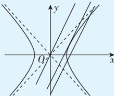

> [!faq]- 答案与解析
>
> > [!success]- **【答案】** $(-1,1)$
>
> > [!note]- **【解析】**
> > 联立直线与双曲线的方程，消去 y 整理得 $(1-k^{2})x^{2}+2k^{2}x-k^{2}-4=0$ ，
> > 由题意，设该方程的两根为 $x_{1},x_{2}$ ，则 $\left\{\begin{aligned}&1-k^{2}\neq0,\\&\Delta=4(4-3k^{2})>0,\\&x_{1}x_{2}=-\frac{k^{2}+4}{1-k^{2}}<0,\end{aligned}\right.$ 解得 -1<k<1.
> > 故实数 k 的取值范围为 $(-1,1)$ .
> > 快解 双曲线 $x^{2}-y^{2}=4$ ，即 $\frac{x^{2}}{4}-\frac{y^{2}}{4}=$ 1, 其渐近线的斜率为 ±1. 因为直线与双曲线相交且交点分别在两支上，所以 -1<k<1. 故实数 k 的取值范围为 $(-1,1)$ .
> > 二级结论 设 l 是斜率为 k 的直线，双曲线 $C:\frac{x^{2}}{a^{2}}-\frac{y^{2}}{b^{2}}=1(a>0,b>0)$ .
> > (1) 如果 $|k| < \frac{b}{a}$ ，那么 l 与 C 有两个交点，它们分别在 C 的不同支上；
> >
> > 
> >
> > (2) 如果 $|k| = \frac{b}{a}$ 并且 $l$ 不是渐近线, 那么 $l$ 与 $C$ 只有一个交点, 此交点不是切点;
> >
> > 
> >
> > (3)如果 $|k|>\frac{b}{a}$ ，那么l与C交点的个数有三种可能：0,1,2（交点个数为1时，交点是切点；交点个数为2时，两交点在C的同一支上）.
> >
> > 
