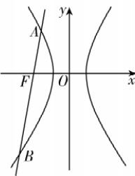

> [!faq]- 答案与解析
>
> > [!success]- **【答案】** D
>
> > [!note]- **【解析】**
> > D 【解析】由双曲线 $C: x^{2} - \frac{y^{2}}{3} = 1$ 可得 $F(-2,0)$ . 由题意知直线 AB 的斜率不为 0, 根据双曲线的对称性, 不妨设过点 F 的直线方程为 $x = my - 2 (m > 0)$ ,
> > 联立 $\left\{\begin{aligned}x=my-2,\\ x^{2}-\frac{y^{2}}{3}=1,\end{aligned}\right.$ 可得 $(3m^{2}-1)y^{2}-12my+9=0,\Delta>0$ ,且 $3m^{2}-1\neq0$ .
> >
> > 设 $A(x_{1},y_{1}),B(x_{2},y_{2})$ ，则 $y_{1} + y_{2} =$ $\frac{12m}{3m^2 - 1},y_1y_2 = \frac{9}{3m^2 - 1}$ ①
> > 由 $|BF| = 2|AF|$ ，得 $\overrightarrow{BF} = 2\overrightarrow{FA}$ ，又 $\overrightarrow{BF} =$ $(-2 - x_{2}, - y_{2}),\overrightarrow{FA} = (x_{1} + 2,y_{1})$ ，所以 $-y_{2} = 2y_{1}$ .②
> > 由①②可得 $y_{1} = -\frac{12m}{3m^{2} - 1},y_{2} =$ $\frac{24m}{3m^2 - 1}$ ，所以 $-\frac{12m}{3m^2 - 1}\cdot \frac{24m}{3m^2 - 1} =$ $\frac{9}{3m^2 - 1}$ 解得 $m = \frac{\sqrt{35}}{35}$ 或 $m = -\frac{\sqrt{35}}{35}$ （舍），则 $y_{1} = \frac{3\sqrt{35}}{8}$ 所以 $|AB| = \sqrt{1 + m^2}\cdot |y_1 - y_2| = \frac{6}{\sqrt{35}}\times$ $3|y_1| = \frac{6}{\sqrt{35}}\times \frac{9\sqrt{35}}{8} = \frac{27}{4}.$ 故选D.
> >
> > 
