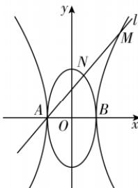

> [!faq]- 答案与解析
>
> > [!success]- **【答案】** B
>
> > [!note]- **【解析】**
> > B 【解析】如图，点 $A(-1,0)$ ，根据题意可设直线 $l$ 的方程为 $y = k(x + 1)$ $(k\neq \pm 2)$ ，将其代入椭圆方程 $x^{2} + \frac{y^{2}}{4} = 1$ 中，整理得 $(k^2 +4)x^2 +2k^2 x + k^2 -4 = 0,\Delta_1 = 64 > 0$ ，依题意， $x_{N}\cdot (-1) = \frac{k^{2} - 4}{k^{2} + 4}$ 得 $x_{N} = \frac{4 - k^{2}}{k^{2} + 4}$ 再将 $y = k(x + 1)$ 代入双曲线方程 $x^{2} - \frac{y^{2}}{4} = 1$ 中，整理得 $(4 - k^2)x^2 -2k^2 x - k^2 -4 = 0,\Delta_2 = 64 > 0,$ 依题意， $x_{M}\cdot (-1) = \frac{-k^{2} - 4}{4 - k^{2}}$ ，得 $x_{M} = \frac{k^{2} + 4}{4 - k^{2}}.$ 由 $\overrightarrow{AN} = \overrightarrow{NM}$ ，可知 $N$ 是 $AM$ 的中点，则 $2x_{N} = x_{A} + x_{M}$ 即 $2\cdot \frac{4 - k^2}{k^2 + 4} = -1 + \frac{4 + k^2}{4 - k^2},$ 解得 $k = \pm \frac{2\sqrt{3}}{3}$ 故选B.
> >
> > 
> >
> > ## 刷易错
> >
> > ## ★易错点 直线与双曲线相交忽视特殊情况而致误
