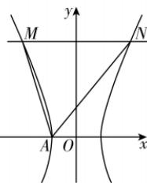

> [!faq]- 答案与解析
>
> > [!success]- **【答案】** D
>
> > [!note]- **【解析】**
> > D 【解析】将 y = 2b 代入 $\frac{x^{2}}{a^{2}} - \frac{y^{2}}{b^{2}} = 1$ 得 $x = \pm \sqrt{5} a$ ，如图所示， $A(-a, 0)$ ， $M(-\sqrt{5}a, 2b)$ ， $N(\sqrt{5}a, 2b)$ ，所以
> >
> > 
> >
> > $k_{AM}k_{AN}=\frac{2b}{-\sqrt{5}a+a}\cdot\frac{2b}{\sqrt{5}a+a}=\frac{4b^{2}}{-4a^{2}}=-\frac{b^{2}}{a^{2}}=-4$ ，则 $\frac{b^{2}}{a^{2}}=4$ ，所以双曲线C的离心率 $e=\sqrt{1+\frac{b^{2}}{a^{2}}}=\sqrt{5}$ 。
> >
> > 故选 **D**.
