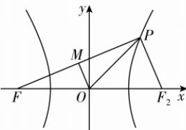

> [!faq]- 答案与解析
>
> > [!success]- **【答案】** D
>
> > [!note]- **【解析】**
> > D 【解析】如图, 取 M 为 PF 的中点, $F_{2}$ 为右焦点, 连接 OM, $PF_{2}$ , 因为 $\overrightarrow{PF} \cdot \overrightarrow{OP} = \overrightarrow{PF} \cdot \overrightarrow{FO}$ ,
> >
> > 
> >
> > 所以 $\overrightarrow{PF} \cdot (\overrightarrow{OP} + \overrightarrow{OF}) = 2\overrightarrow{PF} \cdot \overrightarrow{OM} = 0$ ，所以 $OM \perp PF$ ，所以 $|OP| = |OF| = c$ 。因为 $\overrightarrow{FO}$ 在 $\overrightarrow{FP}$ 上的投影向量的模为 $\frac{12}{13} |\overrightarrow{OF}|$ ，所以 $|FM| = \frac{12}{13} c$ ，所以 $|OM| = \frac{5}{13} c$ ，所以 $|FP| = \frac{24}{13} c$ ， $|PF_{2}| = 2 |OM| = \frac{10}{13} c$ 。因为 $|PF| - |PF_{2}| = 2a$ ，所以 $\frac{24}{13} c - \frac{10}{13} c = 2a$ ，所以 $e = \frac{c}{a} = \frac{13}{7}$ 。
> >
> > 故选 **D**。
