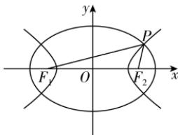

> [!faq]- 答案与解析
>
> > [!success]- **【答案】** B
>
> > [!note]- **【解析】**
> > B 【解析】如图, 设椭圆的长半轴长为 $a_{1}$ , 双曲线的实半轴长为 $a_{2}$ , 椭圆的离心率为 $e_{1}$ , 双曲线的离心率为 $e_{2}$ , 不妨令 $F_{1}$ 为左焦点, $F_{2}$ 为右焦点, 点 P 在第一象限,
> >
> > 
> >
> > 则根据椭圆及双曲线的定义得， $|PF_{1}| + |PF_{2}| = 2a_{1}, |PF_{1}| - |PF_{2}| = 2a_{2}$ ，则 $|PF_{1}| = a_{1} + a_{2}, |PF_{2}| = a_{1} -$ $a_{2}$ ，设 $\left|F_1F_2\right| = 2c$ ，已知 $\angle F_{1}PF_{2} = 60^{\circ}$ 则在 $\triangle PF_1F_2$ 中，由余弦定理得 $\left|F_1F_2\right|^2 = \left|PF_1\right|^2 +\left|PF_2\right|^2 -2\left|PF_1\right|\cdot$ $|PF_2|\cos \angle F_1PF_2,$ 即 $4c^{2} = (a_{1} + a_{2})^{2} + (a_{1} - a_{2})^{2} - 2(a_{1}+$ $a_2)\cdot (a_1 - a_2)\cos 60^\circ$ ，化简得 $a_1^2+$ $3a_{2}^{2} = 4c^{2},$ 点悟：等式两边同时除以 $c^2$ 得到关于 $e_1,e_2$ 的等式所以 $\frac{1}{e_1^2} +\frac{3}{e_2^2} = 4(0 <   e_1 <   1,e_2 > 1)$ ，又因为椭圆的离心率 $e_1 = \frac{\sqrt{10}}{5}$ 所以双曲线的离心率 $e_2 = \sqrt{2}$ ，
> >
> > 故选 **B**.
