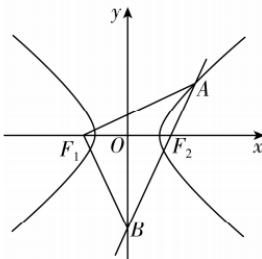

> [!faq]- 答案与解析
>
> > [!success]- **【答案】** D
>
> > [!note]- **【解析】**
> > D 【解析】如图所示, 设 $\left|BF_{1}\right|=m(m>0)$ , 由题意可得 $\left|BF_{2}\right|=m, \left|AF_{2}\right|=\frac{2}{3}m, \left|AF_{1}\right|=\frac{2}{3}m+2a.$ 又 $\left|AB\right|=\left|AF_{2}\right|+\left|BF_{2}\right|$ ，由 $AF_{1}\perp BF_{1}$ 可得 $\left|AF_{1}\right|^{2}+\left|BF_{1}\right|^{2}=\left|AB\right|^{2}$ ,
> > 即 $\left(\frac{2}{3}m+2a\right)^{2}+m^{2}=\left(\frac{2}{3}m+m\right)^{2}$ ，解得 m=3a 或 m=-a（舍），所以 $\left|AF_{2}\right|=2a,\left|AF_{1}\right|=4a,\left|BF_{1}\right|=3a.$ 因为 $\angle AF_{1}O + \angle BF_{1}O = 90^{\circ}, \angle BF_{1}O + \angle F_{1}BO = 90^{\circ}$ ，所以 $\angle AF_{1}O = \angle F_{1}BO$ ，则 $\cos\angle AF_{1}O=\cos\angle F_{1}BO$ ，可得 $\frac{\left|AF_{1}\right|^{2}+\left|F_{1}F_{2}\right|^{2}-\left|AF_{2}\right|^{2}}{2\left|AF_{1}\right|\left|F_{1}F_{2}\right|}=\frac{\left|OB\right|}{\left|BF_{1}\right|}$ 即 $\frac{16a^{2}+4c^{2}-4a^{2}}{2\times4a\times2c}=\frac{\sqrt{9a^{2}-c^{2}}}{3a}$ ，解得 $\frac{c}{a}=\frac{3\sqrt{5}}{5}$ . 故选 D.
> >
> > 
