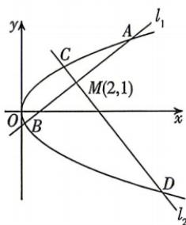

<!-- question-source:start -->
10.[山东泰安2026高二段考]如图,抛物线 $\Gamma$ : $y^{2}=4x$ , $M(2,1)$ 是抛物线内一点,过点M作两条斜率存在且互相垂直的动直线 $l_{1},l_{2}$ ,设 $l_{1}$ 与抛物线 $\Gamma$ 相交于点A,B, $l_{2}$ 与抛物线 $\Gamma$ 相交于点C,D,当M恰好为线段AB的中点时:(1)求直线 $l_{1},l_{2}$ 的斜率之和;

(2) 求 $\frac{|CD|}{|AB|}$ 的值.

<!-- question-source:end -->
