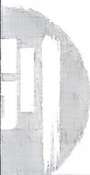

<!-- question-source:start -->
12.[江苏南通2026高二期中]在平面直角坐标系 $xOy$ 中，已知抛物线 $C_1:y^2 = 4x$ 的焦点为 $F_{1}$ ，过点 $F_{1}$ 的直线 $l$ 与抛物线 $C_1$ 交于点 $A_{1},B_{1}$ .连接 $OA_{1},OB_{1}$ 并延长，分别交抛物线 $C_2:y^2 = 2px(p > 0)$ 于点 $A_{2},B_{2}$ ，且 $\mid OA_2\mid =$ $2\mid OA_1\mid .$

(1) 求 $p$ 的值;

(2) 求 $\triangle OA_{2}B_{1}$ 面积的最小值；

(3) 求证: 直线 $A_{2}B_{2}$ 过定点.

## 刷素养
<!-- question-source:end -->
