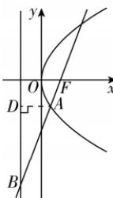

> [!faq]- 答案与解析
>
> > [!success]- **【答案】** B
>
> > [!note]- **【解析】**
> > B【解析】如图，过点 $A$ 作准线的垂线，垂足为 $D$ ，结合抛物线定义，设 $|AD| = |AF| = m,\tan \angle BAD = 2\sqrt{2}$
> >
> > 
> >
> > 由 $\left\{\begin{aligned}\sin\angle BAD&=2\sqrt{2}\cos\angle BAD,\\ \sin^{2}\angle BAD+\cos^{2}\angle BAD&=1,\end{aligned}\right.$ 得 $\cos\angle BAD=\frac{1}{3}$ ，则 $|AB|=3m$ ,
> > 因此 $|BF|=m+3m=8$ ，所以 $|AF|=m=2$ 。
> >
> > 故选 **B**.
