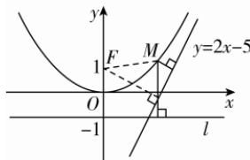

> [!faq]- 答案与解析
>
> > [!success]- **【答案】** D
>
> > [!note]- **【解析】**
> > D 【解析】如图, 抛物线的焦点为 $F(0,1)$ , 连接 MF, 根据抛物线的定义可知, 点 M 到 l 的距离等于 $|MF|$ , 所以点 M 到 l 与到直线 2x-y-5=0 的距离之和即为 $|MF|$ 与点 M 到直线 2x-y-5=0 的距离之和,
> > 由图可知, $|MF|$ 与点 M 到直线 2x-y-5=0 的距离之和的最小值为焦点 $F(0,1)$ 到直线 2x-y-5=0 的距离,
> > 所以 $d=\frac{|2\times0-1-5|}{\sqrt{4+1}}=\frac{6\sqrt{5}}{5}$ 即为所求.
> > 故选 D.
> >
> > 
