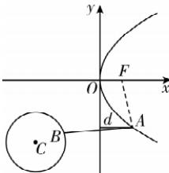

> [!faq]- 答案与解析
>
> > [!success]- **【答案】** 5
>
> > [!note]- **【解析】**
> > 如图, 设抛物线的焦点为 F, 圆心为 C, 连接 AF, 则 $F(2,0)$ , $C(-6,-6)$ , 又圆 C 的半径 r=3,
> > 由抛物线的定义可得 d=|AF|-2，所以|AB|+d=|AB|+|AF|-2，又|AB|+|AF|≥|FC|-r=10-3=7，
> > 当 F,A,B,C 四点共线且 A,B 在线段 FC 上时，等号成立，所以 |AB| + d 的最小值为 7 - 2 = 5.
> >
> > 
> >
> > 名师点拨 抛物线中求解距离之和（差）的最值问题，应尽可能准确画出图形，并利用抛物线上的点到准线和到焦点的距离相等进行转化，最后从几何关系上找到最值成立的状态，一般是点共线时取得.
> >
> > ## 刷提升
