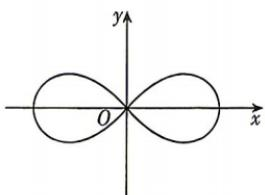

<!-- question-source:start -->
11.[四川南充2025高二期中]我国机器人产业正处在高速发展的黄金时期,机器人正在逐步融入千行百业.通常在规划一些复杂的机器人运动轨迹时,要用到数学曲线中的双纽线.在xOy平面上,把到两个定点 $F_{1}(-a,0)$ , $F_{2}(a,0)$ 距离之积等于 $a^{2}(a>0)$ 的动点轨迹称为双纽线.已知双纽线 $C:(x^{2}+y^{2})^{2}=9(x^{2}-y^{2})$ ,P是曲线C上的一个动点,则下列结论正确的是()

A. 曲线 C 上满足 $\left|PF_{1}\right|=\left|PF_{2}\right|$ 的点 P 有且只有一个
B. 曲线 C 经过 4 个整点（横、纵坐标均为整数的点）

C. 若直线 $y = kx$ 与曲线 $C$ 只有一个交点, 则实数 $k$ 的取值范围为 $(- \infty, -1]$ D. 曲线 $C$ 上任意一点到坐标原点 $O$ 的距离都不超过 3

## 三、填空题: 本大题共 3 小题, 每小题 5 分, 共 15 分.
<!-- question-source:end -->
