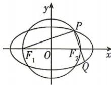

<!-- question-source:start -->
13. 如图, $F_{1}, F_{2}$ 分别是椭圆的左、右焦点, 点 $P$ 是以 $F_{1}F_{2}$ 为直径的圆与椭圆在第一象限内的交点, 延长 $PF_{2}$ 与椭圆交于点 $Q$ . 若 $|PF_{1}| = 4|QF_{2}|$ , 率为

交于点 Q. 若 $\left|PF_{1}\right|=4\left|QF_{2}\right|$ ，则直线 $PF_{2}$ 的斜率为 \_\_\_\_.
<!-- question-source:end -->
