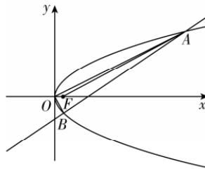

> [!faq]- 答案与解析
>
> > [!success]- **【答案】** B
>
> > [!note]- **【解析】**
> > B 【解析】设点 $A(x_{1}, y_{1})$ , $B(x_{2}, y_{2})$ ,
> > 直线 $AB: x = \frac{3}{2}y + m$ ,
> >
> > 联立 $\left\{\begin{aligned}y^{2}&=2x,\\ x&=\frac{3}{2}y+m,\end{aligned}\right.$ 消去 x 化简得 $y^{2}-3y-2m=0,\Delta=9+8m>0,y_{1}+y_{2}=3,y_{1}y_{2}=-2m<0.$ $\because\overrightarrow{OA}\cdot\overrightarrow{OB}=0,\therefore x_{1}x_{2}+y_{1}y_{2}=0.$ 由 $\left\{\begin{aligned}y_{1}^{2}&=2x_{1},\\ y_{2}^{2}&=2x_{2}\end{aligned}\right.\Rightarrow(y_{1}y_{2})^{2}=4x_{1}x_{2},$ $\therefore x_{1}x_{2}=m^{2}$ ，则 $m^{2}-2m=0$ ，解得 m=2 (m=0 不符合题意，舍去)， $\therefore y^{2}-3y-4=0$ ，解得 $y_{1}=4,y_{2}=-1$ ，又 $F\left(\frac{1}{2},0\right)$ ，直线 $x=\frac{3}{2}y+2$ 与 x 轴交点的横坐标为 2， $\therefore S_{\triangle AOB}=\frac{1}{2}\times2\times(|y_{1}|+|y_{2}|)=\frac{1}{2}\times2\times5=5,S_{\triangle AOF}=\frac{1}{2}|OF|\cdot|y_{1}|=\frac{1}{2}\times\frac{1}{2}\times4=1$ ，则 $S_{\triangle AOB}:S_{\triangle AOF}=5:1.$ 故选 B.
> >
> > 
