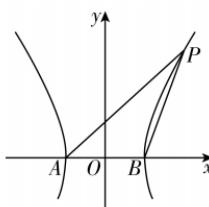

> [!faq]- 答案与解析
>
> > [!success]- **【答案】** AC
>
> > [!note]- **【解析】**
> > AC 【解析】对于 A, 等轴双曲线的离心率为 $\sqrt{2}$ , 故 A 正确; 对于 B, 在 $\triangle PAB$ 中, 由正
> >
> > 
> >
> > 弦定理可知 $\frac{|PA|}{|PB|} = \frac{\sin\beta}{\sin\alpha} = \frac{\sin(\pi - \beta)}{\sin\alpha}$ , 显然 $\pi - \beta, \alpha$ 均为锐角且 $\pi - \beta$ 随着 $x_0$ 的增大而减小, $\alpha$ 随着 $x_0$ 的增大而增大, 即 $\sin (\pi - \beta)$ 随着 $x_0$ 的增大而减小, $\sin \alpha$ 随着 $x_0$ 的增大而增大, 且 $\sin (\pi - \beta), \sin \alpha$ 均为正数, 所以 $\frac{|PA|}{|PB|}$ 的值随着 $x_0$ 的增大而减小, 故 B 错误; 对于 C, $P(x_0, y_0)$ 为双曲线右支上任意一点, 满足 $x_0^2 - y_0^2 = 4$ , $A(-2, 0)$ , $B(2, 0)$ , 因为 $\tan \alpha \cdot \tan \beta = -k_{PA} k_{PB} = -\frac{y_0}{x_0 + 2} \cdot \frac{y_0}{x_0 - 2} = -\frac{y_0^2}{x_0^2 - 4} = -1$ , 故 C 正确; 对于 D: 双曲线 $C: x^2 - y^2 = 4$ 的渐近线方程为 $y = \pm x$ , 点 P 到两条渐近线的距离为 $d_1, d_2$ , 则 $d_1 d_2 = \frac{|x_0 - y_0|}{\sqrt{2}} \cdot \frac{|x_0 + y_0|}{\sqrt{2}} = \frac{|x_0^2 - y_0^2|}{2} = 2$ , 故 D 错误.
> >
> > 故选 **AC**.
