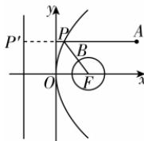

> [!faq]- 答案与解析
>
> > [!success]- **【答案】** 6
>
> > [!note]- **【解析】**
> > 如图，由题意知 $F(2,0)$ 是抛物线 $y^{2}=8x$ 的焦点，直线 x=-2 是抛物线的准
> >
> > 
> >
> > 线, 过点 P 作准线的垂线, 垂足为 $P'$ , 记点 P 到抛物线 $y^{2}=8x$ 的准线的距离为 d, 所以 $|PA|+|PB|\geqslant|PA|+|PF|-1=|PA|+d-1\geqslant5+2-1=6$ , 当且仅当直线 AP 与抛物线的准线垂直, 点 B 在线段 PF 上时, 等号成立, 所以 $|PA|+|PB|$ 的最小值为 6.
