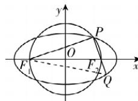

> [!faq]- 答案与解析
>
> > [!success]- **【答案】** -2 <table><tr><td>思路导引</td></tr><tr><td>连接 $QF_1$ ,设 $|QF_2| = x (x > 0)$ ,则 $|PF_1| = 4x$ </td></tr><tr><td>↓利用椭圆的定义表示出 $|PF_2|$ , $|QF_1|$ </td></tr><tr><td>↓由勾股定理求出a与x的关系,得到 $\tan\angle PF_2F_1 = \frac{|PF_1|}{|PF_2|}$ 的值</td></tr><tr><td>↓求出直线 $PF_2$ 的斜率</td></tr></table>
>
> > [!note]- **【解析】**
> > 如图,连接 $QF_{1}$ .
> >
> > 
> >
> > 设 $|QF_{2}|=x(x>0)$ ，则 $|PF_{1}|=4x$ .
> > 因为 $\left|PF_{1}\right|+\left|PF_{2}\right|=2a,\left|QF_{1}\right|+$ $\left|QF_{2}\right|=2a,$ 所以 $\left|PF_{2}\right|=2a-4x,\left|QF_{1}\right|=2a-x.$ 在 $\triangle PF_{1}Q$ 中， $\angle F_{1}PQ=90^{\circ}$ ，所以 $\left|PF_{1}\right|^{2}+\left|PQ\right|^{2}=\left|QF_{1}\right|^{2}$ ，即 $(4x)^{2}+(2a-4x+x)^{2}=(2a-x)^{2}$ ，解得a=3x，
> > 所以 $\tan\angle PF_{2}F_{1}=\frac{|PF_{1}|}{|PF_{2}|}=\frac{4x}{2a-4x}=$ $\frac{4x}{6x-4x}=2$ ，所以直线 $PF_{2}$ 的斜率 k= $\tan(180^{\circ}-\angle PF_{2}F_{1})=-2.$
