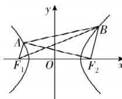

> [!faq]- 答案与解析
>
> > [!success]- **【答案】** $\frac{\sqrt{17}}{3}$
>
> > [!note]- **【解析】**
> > 如图，设 $|AF_{1}| = t (t > 0)$ ，则 $|BF_{2}| = 2t$
> >
> > 
> >
> > $|AF_{2}|=2a+t,|BF_{1}|=2a+2t$ ，因为以AB为直径的圆过 $F_{2}$ ，所以 $AF_{2}\perp BF_{2}$ 。又四边形 $AF_{1}F_{2}B$ 为梯形， $AF_{1}//BF_{2}$ ，所以 $AF_{1}\perp AF_{2}$ ，
> > 则在 Rt△AF₁F₂ 中，由勾股定理可得 $t^{2}+(2a+t)^{2}=(2c)^{2}$ ，整理得 $t^{2}+2at-$
> >
> > $2b^{2}=0.$ 因为 t>0，所以 $t=-a+\sqrt{a^{2}+2b^{2}}$ 。在 Rt $\triangle ABF_{2}$ 中，由勾股定理可得 $|AB|=\sqrt{|BF_{2}|^{2}+|AF_{2}|^{2}}=\sqrt{4t^{2}+(2a+t)^{2}}$ ，且 $\sin\angle BAF_{2}=\frac{2t}{\sqrt{4t^{2}+(2a+t)^{2}}}$ ，则 $\cos\angle BAF_{1}=\cos\left(\angle BAF_{2}+\frac{\pi}{2}\right)=-\sin\angle BAF_{2}=-\frac{2t}{\sqrt{4t^{2}+(2a+t)^{2}}}$ ，在 $\triangle ABF_{1}$ 中，由余弦定理可得 $|BF_{1}|^{2}=|AB|^{2}+|AF_{1}|^{2}-2|AB||AF_{1}|\cos\angle BAF_{1},\therefore(2a+2t)^{2}=4t^{2}+(2a+t)^{2}+t^{2}-2\cdot t\cdot\sqrt{4t^{2}+(2a+t)^{2}}\cdot\frac{-2t}{\sqrt{4t^{2}+(2a+t)^{2}}}$ ，解得 $t=\frac{2a}{3},\therefore\frac{2a}{3}=-a+\sqrt{a^{2}+2b^{2}}$ ，整理得 $\frac{b^{2}}{a^{2}}=\frac{8}{9},\therefore e=\sqrt{1+\frac{b^{2}}{a^{2}}}=\frac{\sqrt{17}}{3}.$
