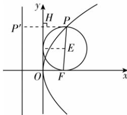

> [!faq]- 答案与解析
>
> > [!success]- **【答案】** 详见解析
>
> > [!note]- **【解析】**
> > 【解】(1) 选①: 设 $P(x, y)$ , 由题意知, $|PF| = |x| + \frac{1}{2}$ , 即 $\sqrt{\left(x - \frac{1}{2}\right)^2 + y^2} = |x| + \frac{1}{2}$ , 整理可得 $y^2 = x + |x|$ , 即 $y^2 = 2x (x > 0)$ 或 $y = 0 (x \leqslant 0)$ , 所以曲线 $C$ 的方程为 $y^2 = 2x (x > 0)$ 或 $y = 0 (x \leqslant 0)$ . 选②: 过点 $P$ 作 $y$ 轴的垂线, 垂足为 $H$ , 交直线 $x = -\frac{1}{2}$ 于点 $P'$ , 设动圆的圆心为 $E$ , 半径为 $r$ , 则点 $E$ 到 $y$ 轴的距离为 $r$ , 在梯形 OFPH 中, 由中位线性质可得 $|PH| = 2r - \frac{1}{2}$ , 所以 $|PP'| = 2r - \frac{1}{2} + \frac{1}{2} = 2r$ , 又 $|PF| = 2r$ , 所以 $|PP'| = |PF|$ ,
> >
> > 由抛物线的定义知, 点 P 是以 $F\left(\frac{1}{2},0\right)$ 为焦点的抛物线,
> > 所以曲线 C 的方程为 $y^{2}=2x$ .
> >
> > 
> >
> > (2) 设 $M(x_{1}, y_{1})$ , $N(x_{2}, y_{2})$ ，将 $y = k(x - 2)$ 代入 $y^{2} = 2x$ ,
> > 消去 y 整理得 $k^{2}x^{2}-2(2k^{2}+1)x+4k^{2}=0.$ 则 $\Delta=4(2k^{2}+1)^{2}-4k^{2}\cdot4k^{2}>0,x_{1}+x_{2}=\frac{2(2k^{2}+1)}{k^{2}}=\frac{4k^{2}+2}{k^{2}},x_{1}x_{2}=4,$ 故 $\left|MN\right|=\sqrt{1+k^{2}}\left|x_{1}-x_{2}\right|$ $=\sqrt{1+k^{2}}\sqrt{(x_{1}+x_{2})^{2}-4x_{1}x_{2}}$ $=\sqrt{1+k^{2}}\sqrt{\frac{(4k^{2}+2)^{2}}{k^{4}}-16}=2\sqrt{10}$ 化简得 $(1+k^{2})(16k^{2}+4)=40k^{4}$ ，解得 $k^{2}=1$ （负值舍去），故 $k=\pm1$ .
