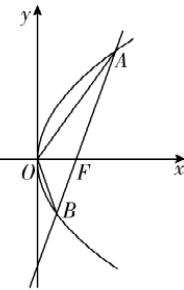

> [!faq]- 答案与解析
>
> > [!success]- **【答案】** C
>
> > [!note]- **【解析】**
> > C 【解析】由题意可知， $|OF|=1$ ，不妨设点 $A(x_{1},y_{1})$ ， $B(x_{2},y_{2})$ ，且点A在
> >
> > 第一象限,如图,则 $\left|AF\right|=x_{1}+1=3\Rightarrow$ $x_{1}=2\Rightarrow y_{1}=2\sqrt{2}$ , $\left|BF\right|=x_{2}+1=\frac{3}{2}\Rightarrow$ $x_{2}=\frac{1}{2}\Rightarrow y_{2}=-\sqrt{2}$ 则 $A(2,2\sqrt{2})$ ,
> >
> > 
> >
> > $B\left(\frac{1}{2},-\sqrt{2}\right)$ ，故 $k_{AB}=\frac{-\sqrt{2}-2\sqrt{2}}{\frac{1}{2}-2}=2\sqrt{2}$ ，所以直线 AB 的方程为 $y-2\sqrt{2}=2\sqrt{2}(x-2)$ ，
> > 令 y=0 得 x=1，则 A, B, F 三点共线，
> > 所以 $S_{\triangle OAB}=S_{\triangle OAF}+S_{\triangle OBF}=\frac{1}{2}|OF||y_{1}-y_{2}|=\frac{1}{2}\times1\times(2\sqrt{2}+\sqrt{2})=\frac{3\sqrt{2}}{2}.$ 巧思：点 O 到直线 AB 的距离为 $d=\frac{2\sqrt{2}}{3}$ ，则 $S_{\triangle OAB}=\frac{1}{2}d\cdot|AB|=\frac{3\sqrt{2}}{2}$
> >
> > 故选 **C**.
