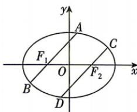

<!-- question-source:start -->
4.[湖北多校2026高二期中联考]如图,椭圆C: $\frac{x^{2}}{4}+\frac{y^{2}}{3}=1$ 的左、右焦点分别为 $F_{1},F_{2}$ ，过点 $F_{1},F_{2}$ 分别作弦AB,CD.若 $AB\parallel CD$ ，则 $|AF_{1}|+|CF_{2}|$ 的最小值为\_\_\_\_.

<!-- question-source:end -->
