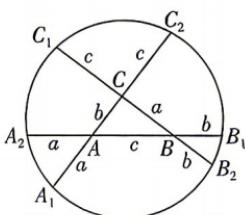

<!-- question-source:start -->
5.[福建泉州多校2025高二联考]“康威圆定理”是英国数学家约翰·康威引以为豪的研究成果之一.定理的内容是这样的:如图,△ABC的三条边长分别为BC=a,AC=b,AB=c,延长线段CA至点 $A_{1}$ ,使得 $AA_{1}=a$ ,以此类推得到点 $A_{2},B_{1},B_{2},C_{1}$ 和 $C_{2}$ ,那么这六个点共圆,这个圆称为康威圆.已知a=4,b=3,c=5,则由△ABC生成的康威圆的半径为()

A. $\sqrt{37}$ B. $\sqrt{39}$ C. $\sqrt{41}$ D. $\sqrt{43}$

## 题型3 圆锥曲线中的新定义、新情境问题
<!-- question-source:end -->
