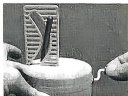

<!-- question-source:start -->
6. 新考法 创新角度 [北京海淀区人大附中 2026 高二质检] 如图, 一个玩具由矩形竖屏, 底面圆盘及斜杆构成, 竖屏垂直于圆盘且固定不动, 圆盘可以转动, 斜杆以恰当的方式固定在圆盘上, 可随着圆盘转动. 当竖屏上的孔隙形状是合适的双曲线的一支时, 斜杆可以自由穿过竖屏的孔隙, 所以这个玩具被称为曲线狭缝玩具. 若斜杆与圆盘所成角的大小为 $60^{\circ}$ , 则合适孔隙的曲线方程可能是 ( )

A. $x^{2} - \frac{y^{2}}{2} = k(k > 0)$ B. $\dot{x}^2 -\frac{y^2}{3} = k(k > 0)$ C. $x^{2} - \frac{y^{2}}{4} = k(k > 0)$ D. $x^{2} - \frac{y^{2}}{5} = k(k > 0)$
<!-- question-source:end -->
