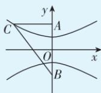

> [!faq]- 答案与解析
>
> > [!success]- **【答案】** C
>
> > [!note]- **【解析】**
> > C【解析】由题可设双曲线的方程为 $\frac{y^2}{a^2} -\frac{x^2}{b^2} = 1(a > 0,b > 0).$ 根据已知条件可得 $\left\{\frac{a^2 + b^2 = c^2 = 4^2}{\frac{4^2}{a^2} - \frac{(-6)^2}{b^2}} = 1,\right.$ 解得 $\left\{ \begin{array}{l}a = 2,\\ c = 4. \end{array} \right.$ 则该双曲线的离心率 $e = \frac{c}{a} = \frac{4}{2} = 2.$ 故选C.
> >
> > 多种解法 设该双曲线的焦距为2c, 实轴长为2a, 由题知 c=4, $2a=\sqrt{(-6)^{2}+(4+4)^{2}}-\sqrt{(-6)^{2}+(4-4)^{2}}=4$ , 则 a=2, 则该双曲线的离心率 $e=\frac{c}{a}=2$ . 故选 C.
> >
> > 快解 如图，记 $A(0,4)$ , $B(0,-4)$ , $C(-6,4)$ ，则 $AB \perp AC$ ， $|AB| = 8$ ， $|AC|=6$ ，则 $|BC|=$
> >
> > 
> >
> > 10, 又该双曲线的半焦距 c=4，实轴长 $2a=|BC|-|AC|=4$ ，则 a=2，则该双曲线的离心率 $e=\frac{c}{a}=2$ 。
> >
> > 故选 **C**.
