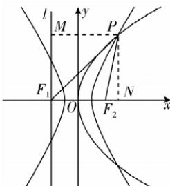

> [!faq]- 答案与解析
>
> > [!success]- **【答案】** A
>
> > [!note]- **【解析】**
> > A 【解析】由双曲线的定义得 $|PF_{1}| - |PF_{2}| = 2a$ ，①
> > 又 $|PF_{1}| + |PF_{2}| = 3|F_{1}F_{2}| = 6c$ ，②
> > 联立①②，解得 $\left\{\begin{aligned}|PF_{1}| &= 3c + a, \\|PF_{2}| &= 3c - a.\end{aligned}\right.$ 设抛物线的准线为 $l$ ，则 $l$ 过点 $F_{1}$ ，过点 $P$ 作 $PM \perp l$ 于点 $M$ ，由抛物线的定义得 $|PF_{2}| = |PM| = 3c - a$ .
> > 过点 $P$ 作 $PN \perp x$ 轴于点 $N$ ，则 $|F_{2}N| = 3c - a - 2c = c - a$ ,
> > 在 Rt $\triangle PMF_{1}$ 中， $|MF_{1}|^{2} = |PF_{1}|^{2} - |PM|^{2} = (3c + a)^{2} - (3c - a)^{2}$ ,
> > 在 Rt $\triangle PF_{2}N$ 中， $|PN|^{2} = |PF_{2}|^{2} - |F_{2}N|^{2} = (3c - a)^{2} - (c - a)^{2}$ ,
> > 又 $|PN| = |MF_{1}|$ ，所以 $|PF_{1}|^{2} - |PM|^{2} = |PF_{2}|^{2} - |F_{2}N|^{2}$ ，即 $(3c + a)^{2} - (3c - a)^{2} = (3c - a)^{2} - (c - a)^{2}$ ,
> > 整理得 $8c^{2} - 16ac = 0$ ，即 $\frac{c}{a} - 2 = 0$ ，所以 $e = \frac{c}{a} = 2$ ，故选 A.
> >
> > 
